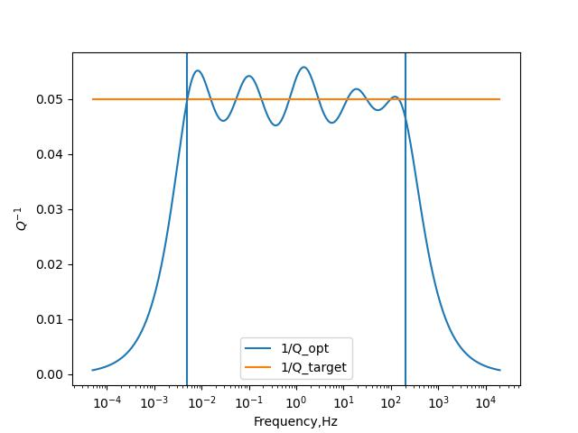

# Tutorial

## SpecSWD Models
**SpecSWD** use a mixture 1-D model (linear variation model with discontinuities). The discontinuities is marked by two group of quantities defined at the same depth. **SpecSWD** currently support 3 type of different models: VTI-Love wave model, VTI-Rayleigh wave model, full-anisotropic model. The format is as below:

### Love wave model
In VTI media (or radial anisotropy), only 2 velocities `Vsv,Vsh` and corresponding quality factor `Ql,Qn` are related to love wave. 

### Rayleigh (Scholte) wave model
For Rayleigh wave, generally we need 3 velocities `Vph,Vpv,Vsv`, their corresponding quality factor `Qa,Qc,Ql`, and a ratio factor `eta`. If this model also involves acoutic regions, you should set the `Vsv = 0` and `Vpv=Vph, Qa=Qc` in these regions to make the program know it's acoutic. Also at elastic-acoustic boundary, a discontinuty is required.

### Fully anisotropic wave model
For fully-anisotropic model, we need 21 parameters. It should be flattened like:
```python
id = 0
for i in range(6):
    for j in range(i,6):
        c21_flat[id] = c66[i,j]
        id += 1
```
The quality factors in anisotropic media is user defined. The default implementation is only focus on the isotropic part of the media, and thus requires $Q_{\kappa}$ and $Q_{\mu}$ ([Carcione 1990](https://academic.oup.com/gji/article/101/3/739/602971)). High-level users can go to `src/shared/attenuation.cpp` to define their own quality factors. If anisotropic media also includes acoustic layer, it should be set like a isotropic `c21` with zero out corresponding elements.

## Q model
This program use standard linear solids to model attenuation effects. The correction method ([van Driel et al, 2014](https://academic.oup.com/gji/article/199/2/1078/624157?login=true)) make us only do one non-linear inversion to get coefficients that can be used for many Qs. The current coefficients in this program only be valid for 0.01-100 Hz (see figure below). If your application requires Q at different frequency domain, you can use `scripts/attenuation.py` to compute your coefficients, and paste to `src/attenuation.cpp`. 


*Q model estimated by SLS model*

## Example
```python
#!/bin/python3
import numpy as np 
from specd import SpecWorkSpace

# set a model for Love wave, discontinuities is at 35 km
model = np.array([
    [0.0000000, 2.800000, 3.300000, 3.000000, 220., 200.],
    [35.000000, 2.800000, 3.300000, 3.000000, 220., 200.],
    [35.000000, 3.200000, 5.500000, 5.000000, 330., 300.]
])
z,rho,vsh,vsv,_,_ = (model[:, i].reshape(3) for i in range(6))

# create work space
ws = SpecWorkSpace('love',z,rho,vsh=vsh,vsv=vsv,disp=True)

# compute phase velocity
c = ws.compute_egn(1.,-1,False)
print(c)
```