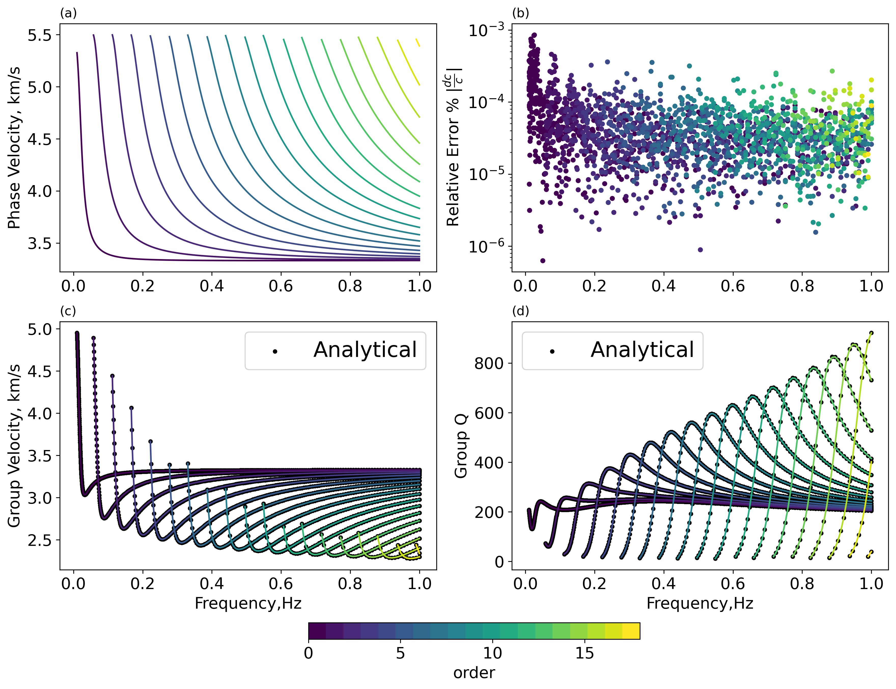
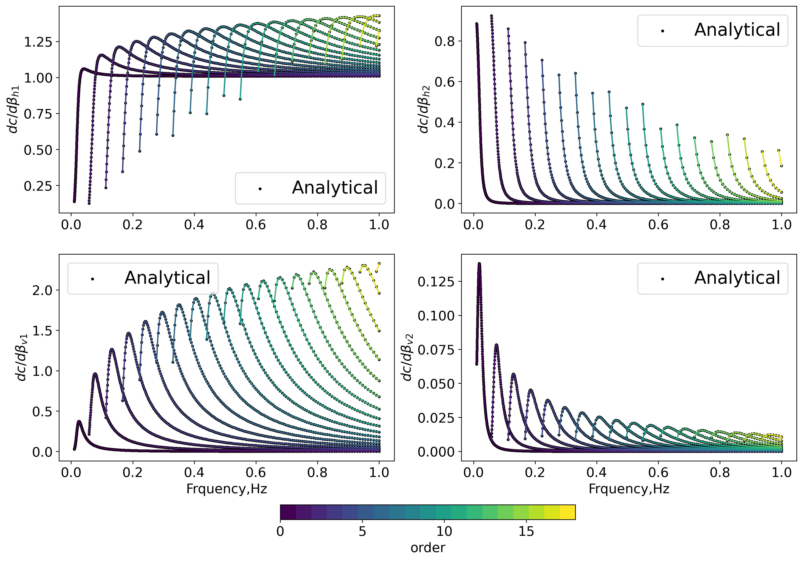
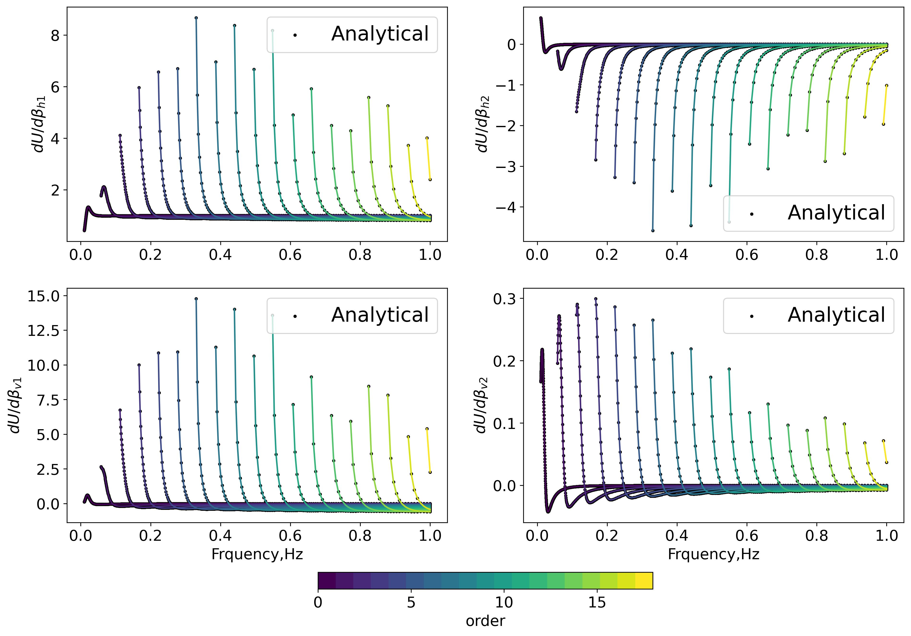

# Gallery
## Two layer Love wave Model
| Layer Number    | h | $\rho$ | $\beta_{v}$| $\beta_{h}$ | $Q_L$ | $Q_N$ |
| -------- | ------- |---- |--| --| -- | --|
| 1  | 35   | 2.8 | 3.0 | 3.3 | 220 | 200 |
| 2 | $\infty$ | 3.2 | 5.0 | 5.5 |330 |300|

*Benchmark of phase/group/group Q ith Analytical Solution*

*Benchmark of phase velocity sensitivity kernels ith Analytical Solution*

*Benchmark of group velocity sensitivity kernels ith Analytical Solution*

<!-- # Gallery
### Benchmark: SWDTTI with CPS330

### HTI model: Phase velocity vs. Azimuthal angle

### Fluid-Elastic Coupling phase and group velocity

### Acoustic  -->